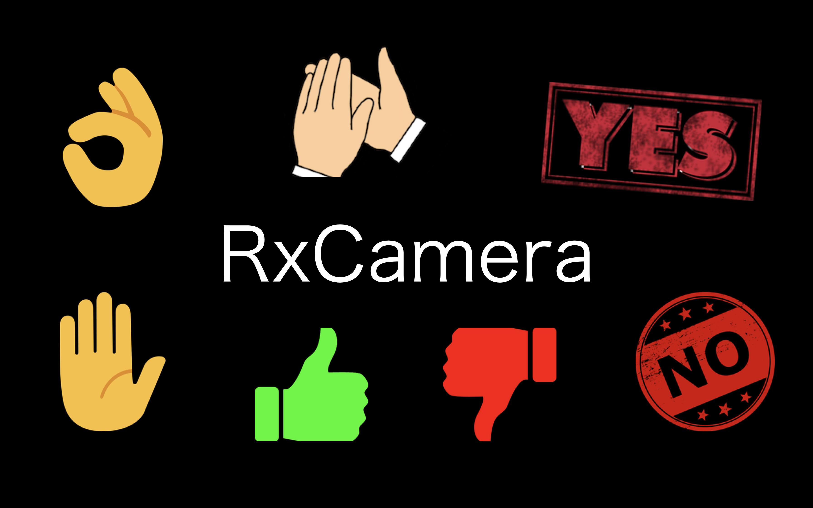
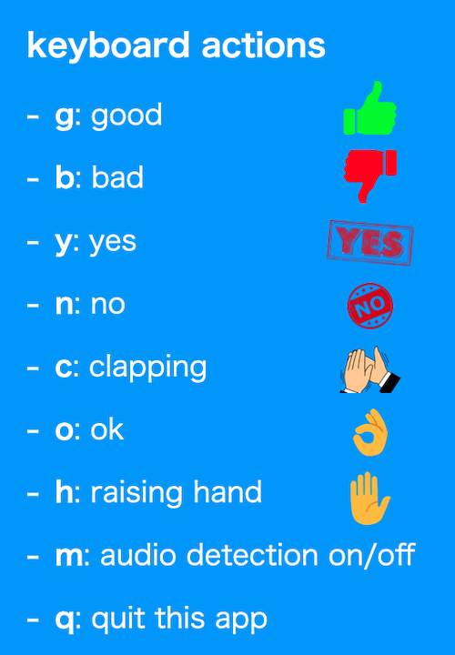

# RxCamera

## 製品概要

### 背景(製品開発のきっかけ、課題等）

私たちが着目した課題は，対面に比べたオンライン会議のしづらさです．近年，コロナウイル感染防止のため Zoom などのオンラインツールを用いて人と話す機会が増えていました．しかし，就活やオンライン授業などで，やりづらさを感じた方も多いのではないでしょうか．その原因は，相手の反応が見えないことだと私たちは考えています．
そこで，私たちが作ったのがカメラアプリ『RxCamera』です．RxCamera を用いることで，単にリアクションを可視化するだけでなく，オンライン会議を盛り上げながら進行することができるようになります．

### 製品説明（具体的な製品の説明）

Python で RxCamera を起動して，OBS バーチャルカメラで指定することによって，利用可能になります．
この RxCamera を用いることで，青い欄に記載されているキーを押すと，それに応じた画像を画面に表示することができるようになります．また，機械学習を用いた音声認識により，『Yes』，『No』，『拍手の音』は音声でも表示できるようにしました（この音声認識は，キーを押すことで on/off の切り替えが可能です）．

### 特長

#### 1. キーボードを用いたリアクションの可視化とアプリの制御

それぞれのキーに対応したアクションを行います．

#### 2. 機械学習を用いた音声認識による音声でのリアクションの可視化

自作モデルを用いた音声認識も実装しました．この昨日は m キーを押すことで on/off の切り替えが可能です．

#### 3. Zoom や Discord など既存のオンラインツールと合わせて利用可能

デモ動画では Zoom を用いていますが，他のオンラインツールでも使用できます．

### 解決出来ること

スピーカーが話す際に，他の人のリアクションが見えず，一人の空間で話してしまっているような感覚になることを防ぎます．また，手軽な動作で様々なリアクションを取ることができるため，オンライン会議を活発にします．

### 今後の展望

- キーボードのアクションのカスタマイズ機能
  - ユーザーが自分でキーに対応するアクションを作成できるようにする
- 音声認識の精度向上と音声の追加

### 注力したこと（こだわり等）

- 『簡単な』キーボード操作だけで，カメラ上にリアクションを表現可能
- 音声認識を用いることで音声だけで『手軽に』リアクションを表現可能
- 機械学習による音声認識も外部の API を使用せずに，自作のモデルを使用

## 開発技術

### 活用した技術

#### API・データ

- 特になし

#### フレームワーク・ライブラリ・モジュール

- OpenCV
- NumPy
- PyAudio
- Scikit-learn

#### デバイス

- macOS

### 独自技術

#### ハッカソンで開発した独自機能・技術

- 機械学習を用いた音の検知
  - データ収集からモデルの作成まで全て自作
- カメラで映し出した映像に画像を表示
